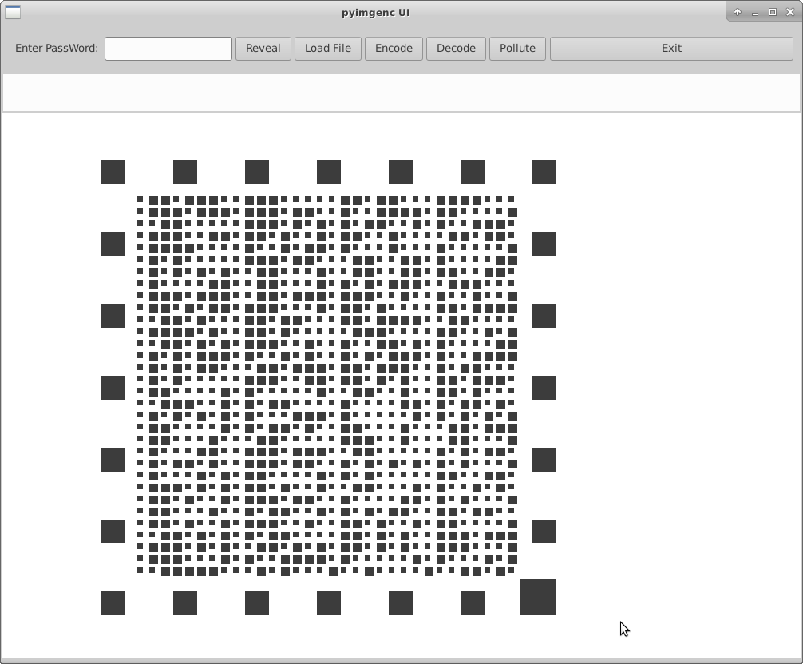

# pyimgdata

  QR Code like label.

  The objective is to create an eazy to read, checksummed matrix, that withstands
noise, data pollution, distortion, wear and all possible deterioration.

  The code works on the principle of pitch, where the pich is the imaginary
matrix that contains the small or big dots. (corresponding to zeros and ones)

  The initial version has a 32 x 32 matrix, containing 128 bytes; 124 + crc checksum
in its original form.

  The generator is using only 2 graphical primitives and is only 20 lines of code.

  All in python ... 'C' coming soon.

  Progress:

  Generator - done
  Scan line logic - in progress

  
